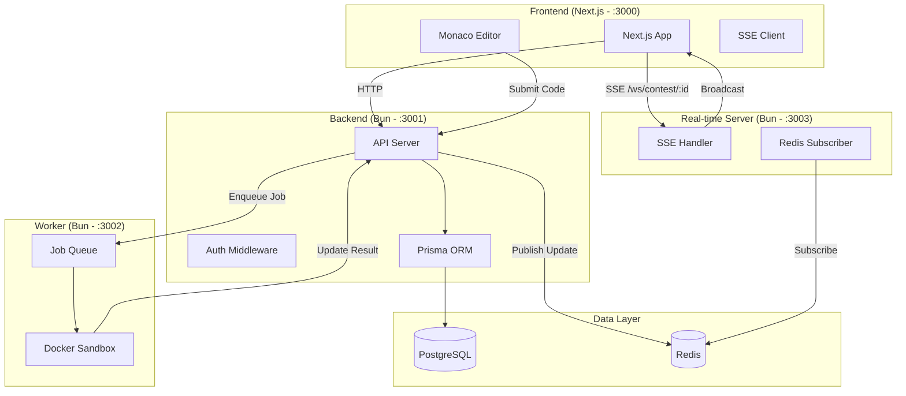
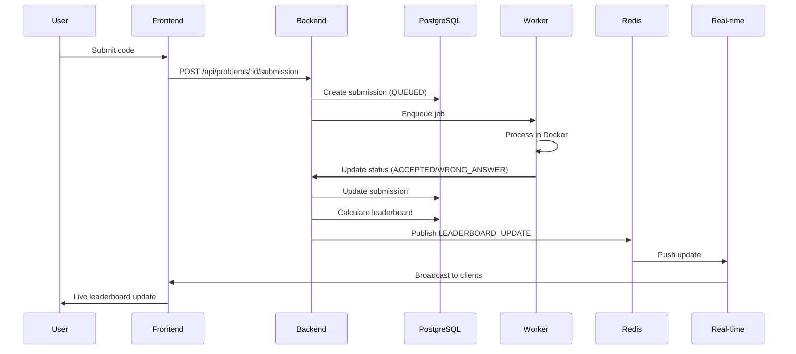
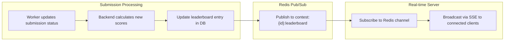

# AlgoHaven

Contest platform similar to Codeforces

---

## Quick Start

### 1. Start Database (Docker)

```sh
docker compose up
```

### 2. Configure Environment

```sh
cp .env.example .env
```

Generate secrets and add them to `.env`:

```sh
# macOS/Linux
sed -i '' "s/^WORKER_SECRET=.*/WORKER_SECRET=$(openssl rand -hex 32)/" .env
sed -i '' "s/^POSTGRES_USER=.*/POSTGRES_USER=$(openssl rand -hex 8)/" .env
sed -i '' "s/^POSTGRES_PASSWORD=.*/POSTGRES_PASSWORD=$(openssl rand -hex 16)/" .env
```

The worker also requires these shared values in `.env`:

- `BACKEND_URL=http://localhost:3001`
- `WORKER_SECRET=<same secret used by the backend>`

### 3. Run Migrations

```sh
bunx prisma migrate dev --schema=packages/db/prisma/schema.prisma
```

### 4. Start Development

```sh
bun run dev
```

- Backend: http://localhost:3001
- Frontend: http://localhost:3000

### 5. Dev Login (Testing)

For quick testing without email:

```
http://localhost:3000/dev-login
```

---

## Auth

- Password-based authentication
- Session management with HttpOnly cookies
- Role-based access (USER/ADMIN)

### API Endpoints

| Endpoint              | Method | Description          |
| --------------------- | ------ | -------------------- |
| `/api/auth/signout`   | POST   | Sign out             |
| `/api/auth/me`        | GET    | Get current user     |
| `/api/auth/dev-login` | POST   | Dev-only quick login |

### Response Format

All API responses use consistent format:

```json
{
  "status": "success",
  "message": "Operation description",
  "data": { ... },
  "error": null,
  "timestamp": "2026-03-21T..."
}
```

---

## Database Schema

### Prisma Models

| Model              | Key Fields                                                                               |
| ------------------ | ---------------------------------------------------------------------------------------- |
| `User`             | `id`, `email`, `role` (USER/ADMIN), `username`                                           |
| `Session`          | `id`, `tokenHash`, `userId`, `expiresAt`                                                 |
| `Problem`          | `id`, `title`, `slug`, `difficulty`, `statement`, `tags`, `timeLimitMs`, `memoryLimitKb` |
| `TestCase`         | `id`, `problemId`, `input`, `expectedOutput`, `isSample`, `points`                       |
| `Contest`          | `id`, `title`, `slug`, `startTime`, `endTime`, `visibility`, `isRated`, `freezeTime`     |
| `ContestProblem`   | `id`, `contestId`, `problemId`, `index`, `points`                                        |
| `Submission`       | `id`, `userId`, `problemId`, `contestId`, `code`, `language`, `status`, `judgePhase`     |
| `LeaderboardEntry` | `id`, `contestId`, `userId`, `totalPoints`, `solved`, `penaltyMins`, `isFrozen`          |
| `LeaderboardSnapshot` | `id`, `contestId`, `userId`, `totalPoints`, `solved`, `penaltyMins`, `snapshotTime`  |
| `UserRating`       | `id`, `userId`, `contestId`, `ratingBefore`, `ratingAfter`, `rank`                       |
| `PlagiarismReport` | `id`, `submissionId`, `similarityScore`, `status`                                        |
| `RejudgeJob`       | `id`, `problemId`, `contestId`, `submissionId`, `status`                                 |

### Enums

- **Role**: `USER`, `ADMIN`
- **Difficulty**: `EASY`, `MEDIUM`, `HARD`
- **ContestVisibility**: `PUBLIC`, `INVITE`, `PRIVATE`
- **SubmissionStatus**: `QUEUED`, `RUNNING`, `ACCEPTED`, `WRONG_ANSWER`, `TLE`, `MLE`, `RUNTIME_ERROR`, `COMPILE_ERROR`
- **JudgePhase**: `PRACTICE`, `CONTEST_PHASE1`, `CONTEST_PHASE2`

---

## Test Case Storage

Test cases are stored as **relational rows** (NOT JSON):

```prisma
model TestCase {
  id             String  @id @default(uuid())
  problemId      String
  input          String
  expectedOutput String
  isSample       Boolean @default(false)
  points         Int     @default(0)
}
```

**Benefits:**

- Easy add/edit/delete of individual test cases
- Query hidden vs sample test cases via `isSample` field
- Index on `problemId` for fast lookups
- Per-test-case scoring (for partial credit)

---

## API Endpoints

### Problems

| Endpoint                       | Method | Auth  | Description         |
| ------------------------------ | ------ | ----- | ------------------- |
| `/api/problems`                | GET    | -     | List problems       |
| `/api/problems/:id`            | GET    | -     | Get problem details |
| `/api/problem/create`          | POST   | ADMIN | Create problem      |
| `/api/problems/:id/submission` | POST   | USER  | Submit solution     |

### Contests

| Endpoint                         | Method   | Auth    | Description              |
| -------------------------------- | -------- | ------- | ------------------------ |
| `/api/contest`                   | GET      | -       | List contests            |
| `/api/contest/create`            | POST     | ADMIN   | Create contest           |
| `/api/contest/:id`               | GET      | -       | Get contest details      |
| `/api/contest/:id/register`      | POST     | USER    | Register for contest     |
| `/api/contest/:id/unregister`    | POST     | USER    | Unregister               |
| `/api/contest/:id/problems`      | GET      | USER    | Get contest problems     |
| `/api/contest/:id/submission`    | POST     | USER    | Submit to contest        |
| `/api/contest/:id/leaderboard`   | GET      | -       | Get leaderboard          |
| `/api/contest/:id/ratings`       | GET      | -       | Get ratings              |
| `/api/contest/:id/announcements` | GET/POST | -/ADMIN | Get/create announcements |
| `/api/contest/:id/freeze`        | POST     | Worker  | Freeze leaderboard       |

### Submissions

| Endpoint                      | Method | Auth | Description           |
| ----------------------------- | ------ | ---- | --------------------- |
| `/api/submissions/:id/status` | GET    | USER | Get submission status |

### Worker (port 3002)

| Endpoint                                | Method | Auth | Description                     |
| --------------------------------------- | ------ | ---- | ------------------------------- |
| `/api/worker/health`                    | GET    | -    | Worker health check             |
| `/api/worker/enqueue`                   | POST   | -    | Enqueue code for execute        |
| `/api/worker/update-submission`         | POST   | -    | Update submission result        |
| `/api/worker/schedule-rating`           | POST   | -    | Schedule rating calc job        |
| `/api/worker/schedule-phase-transition` | POST   | -    | Schedule phase 1→2 job          |
| `/api/worker/schedule-freeze`           | POST   | -    | Schedule leaderboard freeze job |
| `/api/worker/transition-judge-phase`    | POST   | -    | Transition phase 1→2            |

---

## Testing with curl

```bash
# Login to get session cookie
curl -c cookies.txt -X POST http://localhost:3001/api/auth/dev-login \
  -H "Content-Type: application/json" \
  -d '{"email":"test@test.com"}'

# Submit solution (replace :problemId)
curl -X POST "http://localhost:3001/api/problems/:problemId/submission" \
  -H "Content-Type: application/json" \
  -b cookies.txt \
  -d '{"code":"console.log(1)","language":"javascript"}'

# Check submission status (replace :submissionId)
curl "http://localhost:3001/api/submissions/:submissionId/status" -b cookies.txt

# Worker health
curl http://localhost:3002/api/worker/health

# Worker enqueue (direct)
curl -X POST http://localhost:3002/api/worker/enqueue \
  -H "Content-Type: application/json" \
  -d '{"code":"console.log(1+1)"}'
```

---

## Deployment

### Prerequisites
- EC2 instance (Ubuntu 22.04+) with Docker + Docker Compose installed
- GitHub repository with these secrets configured:
  - `EC2_HOST` — your EC2 public IP
  - `EC2_USERNAME` — typically `ubuntu`
  - `EC2_SSH_KEY` — private SSH key

### One-time EC2 setup

```sh
# SSH into your EC2 instance
ssh ubuntu@<EC2_HOST>

# Clone the repo
git clone https://github.com/<your-org>/AlgoHaven.git
cd AlgoHaven

# Create production .env
cp .env.example .env
# Edit .env with production values (see below)
```

### Production .env variables

```sh
DATABASE_URL="postgresql://postgres:<strong-password>@db:5432/algohaven"
POSTGRES_USER=postgres
POSTGRES_PASSWORD=<strong-password>
POSTGRES_DB=algohaven

AUTH_SECRET=<random-64-char-hex>
SESSION_COOKIE_NAME=algohaven_session
SESSION_TTL_MS=604800000

WORKER_SECRET=<random-64-char-hex>
WORKER_URL=http://worker:3002
BE_URL=http://be:3001

REDIS_URL=redis://:<strong-redis-password>@redis:6379
REDIS_PASSWORD=<strong-redis-password>

NEXT_PUBLIC_BE_URL=http://<EC2_HOST>:3001
CORS_ALLOWED_ORIGINS=http://<EC2_HOST>:3000
```

### Manual deploy

```sh
docker compose -f docker-compose.prod.yml up -d --build
```

### CI/CD (automatic on push to main)

Push to `main` triggers GitHub Actions which SSH into EC2 and runs:
```sh
docker compose -f docker-compose.prod.yml down
docker compose -f docker-compose.prod.yml build --no-cache
docker compose -f docker-compose.prod.yml up -d
```

### Services

| Service | Port | Description |
|---------|------|-------------|
| Frontend | 3000 | Next.js UI |
| Backend | 3001 | REST API |
| Worker | 3002 | Code execution (Docker-in-Docker) |
| WebSocket | 3003 | SSE real-time updates |

### Useful commands

```sh
# View logs
docker compose -f docker-compose.prod.yml logs -f be
docker compose -f docker-compose.prod.yml logs -f worker

# Run Prisma migration manually
docker compose -f docker-compose.prod.yml exec be bunx prisma migrate deploy --schema=../../packages/db/prisma/schema.prisma

# Restart a single service
docker compose -f docker-compose.prod.yml restart worker
```

---

## Features

### Completed ✅

- [x] Session management
- [x] Problem CRUD (backend + frontend)
- [x] Problem delete endpoint
- [x] Contest CRUD (backend)
- [x] Submission handling
- [x] Docker code execution sandbox
- [x] Leaderboard (basic)
- [x] Real-time leaderboard (SSE + Redis)
- [x] User ratings (basic)
- [x] Admin auth middleware
- [x] Admin dashboard (frontend)
- [x] Admin problem list view
- [x] Admin contest list view
- [x] Problem creation form
- [x] Contest creation form
- [x] Beautified API responses
- [x] Monaco editor for code submission
- [x] User management (make users admin)
- [x] Problem/contest edit functionality
- [x] Add more languages (C++, Java, Go)
- [x] Virtual contests (practice mode on past contests)
- [x] Two-phase contest evaluation (sample → full test suite)
- [x] Custom checker execution
- [x] Leaderboard freeze automation
- [x] Public profile streak + heatmap
- [x] RejudgeJob workflow
- [x] Rating system post-contest (automated 3-day delay via BullMQ)
- [x] Plagiarism detection (hash-based, runs after contest ends)
- [x] Persist freeze snapshot (immutable leaderboard at freeze time)
- [x] Docker deployment (all 4 services containerized)
- [x] CI/CD (GitHub Actions → EC2 deploy)

---

## Architecture



### Service Ports

| Service   | Port | Purpose         |
| --------- | ---- | --------------- |
| Frontend  | 3000 | Next.js UI      |
| Backend   | 3001 | REST API        |
| Worker    | 3002 | Code execution  |
| Real-time | 3003 | SSE / WebSocket |

### Data Flow: Submission



### Data Flow: Real-time Leaderboard



---

[System Design](./design.md)
