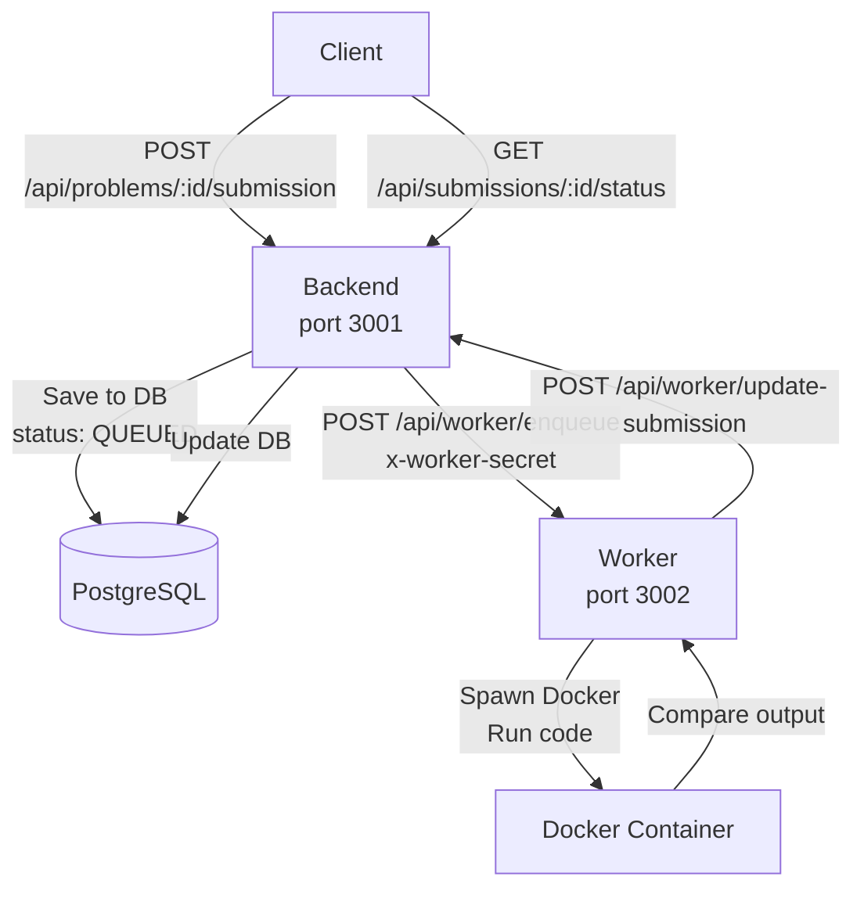

# Code Execution Service

## Overview

Docker-based code execution sandbox for competitive programming. Each submission runs in an isolated container with strict resource limits.

---

## Architecture



### Components

| Component | Port | Description                                        |
| --------- | ---- | -------------------------------------------------- |
| Backend   | 3001 | Handles submissions, stores results in DB          |
| Worker    | 3002 | Executes code in Docker, judges against test cases |

---

## Implementation

### Backend Routes

**Submit solution** - `POST /api/problems/:id/submission`

```typescript
// Request
{
  code: string,
  language: "python" | "javascript" | "cpp" | "java" | "go"
}

// Response
{
  status: "success",
  data: { submission_id: string, status: "QUEUED" }
}
```

**Check status** - `GET /api/submissions/:id/status`

```typescript
// Response
{
  status: "success",
  data: { status: "ACCEPTED" | "WRONG_ANSWER" | "TLE" | ... }
}
```

### Worker API

**Enqueue job** - `POST /api/worker/enqueue`

- Header: `x-worker-secret` (auth verification)
- Body: `{ submissionId, code, language, testCases[] }`

**Update submission** - `POST /api/worker/update-submission`

- Header: `x-worker-secret`
- Body: `{ submissionId, status, points, executionTimeMs }`

---

## Docker Security Configuration

### Container Hardening

```bash
docker run \
  --rm \
  --cpus="0.5" \
  --memory="256m" \
  --pids-limit=50 \
  --cap-drop="ALL" \
  --network="none" \
  --user=1000 \
  --security-opt="no-new-privileges" \
  python:3.11-slim \
  python /tmp/submission.py < /tmp/input.txt
```

### Key Security Measures

| Flag                                 | Purpose                      |
| ------------------------------------ | ---------------------------- |
| `--cpus="0.5"`                       | Limit CPU to 0.5 cores       |
| `--memory="256m"`                    | Limit RAM to 256MB           |
| `--network="none"`                   | No network access            |
| `--read-only`                        | Read-only filesystem         |
| `--tmpfs=/tmp:size=64m`              | Writable temp in memory      |
| `--user=1000`                        | Run as non-root              |
| `--cap-drop="ALL"`                   | Drop all capabilities        |
| `--security-opt="no-new-privileges"` | Prevent privilege escalation |
| `--pids-limit=50`                    | Limit process count          |

### Resource Limits

| Protection  | Limit                       |
| ----------- | --------------------------- |
| Timeout     | 5-15 seconds (per language) |
| Code size   | 50 KB                       |
| Input size  | 10 KB                       |
| Output size | 100 KB                      |

---

## Supported Languages

| Language   | Docker Image             | Timeout (s) |
| ---------- | ------------------------ | ----------- |
| Python     | `python:3.11-slim`       | 5           |
| JavaScript | `node:20-slim`           | 5           |
| C++        | `gcc:13.2.0`             | 10          |
| Java       | `eclipse-temurin:21-jdk` | 15          |
| Go         | `golang:1.21`            | 10          |

---

## Execution Flow

### 1. User Submits Code

```bash
curl -X POST "http://localhost:3001/api/problems/:id/submission" \
  -H "Content-Type: application/json" \
  -d '{"code":"import sys\n...", "language":"python"}'
```

### 2. Backend Processing

1. Save submission to DB (status: QUEUED)
2. Fetch test cases for problem
3. POST to worker API with code + test cases

### 3. Worker Processing

1. Receive job via `/api/worker/enqueue`
2. For each test case:
   - Spawn Docker container
   - Run code with test input
   - Capture stdout/stderr
   - Compare output to expected
3. Update submission status via `/api/worker/update-submission`

### 4. User Polls Status

```bash
curl "http://localhost:3001/api/submissions/:id/status"
# Returns: { status: "ACCEPTED", executionTimeMs: 418 }
```

---

## Code Execution (Worker)

### Docker Command Building

```typescript
// Python example
function buildDockerCommand(code: string, input: string): string[] {
  const codeB64 = toBase64(code);
  const inputB64 = toBase64(input);

  return [
    "docker",
    "run",
    "--rm",
    "--cpus=0.5",
    "--memory=256m",
    "--network=none",
    "--user=1000",
    "python:3.11-slim",
    "bash",
    "-c",
    `printf '%s' '${codeB64}' | base64 -d > /tmp/submission.py && python3 /tmp/submission.py`,
  ];
}
```

### Output Comparison

```typescript
const actual = result.stdout.trim();
const expected = testCase.expectedOutput.trim();

if (actual === expected) {
  // Test case passed
} else {
  // Wrong answer
}
```

---

## Test Case Format

Test cases stored in PostgreSQL as relational rows:

```sql
-- Sample test case (shown to users)
INSERT INTO "TestCase" ("problemId", input, "expectedOutput", "isSample")
VALUES (:problemId, '4\n2 7 11 15\n9', '0 1', true);

-- Hidden test case (judging only)
INSERT INTO "TestCase" ("problemId", input, "expectedOutput", "isSample")
VALUES (:problemId, '3\n3 2 4\n6', '1 2', false);
```

---

## Verdict Types

| Status          | Description              |
| --------------- | ------------------------ |
| `QUEUED`        | Submission received      |
| `RUNNING`       | Currently being judged   |
| `ACCEPTED`      | All test cases passed    |
| `WRONG_ANSWER`  | Output mismatch          |
| `TLE`           | Time limit exceeded      |
| `MLE`           | Memory limit exceeded    |
| `RUNTIME_ERROR` | Crashed during execution |
| `COMPILE_ERROR` | Compilation failed       |

---

## Queue System

### Current Implementation (In-Memory)

```typescript
// apps/worker/queue.ts
const jobQueue: Job[] = [];

export function enqueueSubmission(job: Job): void {
  jobQueue.push(job);
}

export function getNextJob(): Job | undefined {
  return jobQueue.shift();
}
```

### Production (Future - Redis Bull)

```typescript
import Queue from "bull";
const submissionQueue = new Queue("submissions", "redis://localhost:6379");

await submissionQueue.add({
  submissionId: submission.id,
  code: submission.code,
  language: submission.language,
  testCases: testCases,
});
```

---

## Environment Variables

| Variable        | Value                      |
| --------------- | -------------------------- |
| `WORKER_SECRET` | Auth secret for worker API |
| `WORKER_URL`    | `http://localhost:3002`    |
| `BACKEND_URL`   | `http://localhost:3001`    |

---

## Scaling

### Pre-Contest Warmup

```bash
# Pre-pull images before contest
docker pull python:3.11-slim
docker pull node:20-slim
docker pull gcc:13.2.0
docker pull eclipse-temurin:21-jdk
docker pull golang:1.21
```

### Horizontal Scaling

- Add more worker nodes
- Use Kubernetes/Docker Swarm
- Auto-scale based on queue depth

---

## Files

| File                           | Description                  |
| ------------------------------ | ---------------------------- |
| `apps/worker/index.ts`         | Main worker service          |
| `apps/worker/queue.ts`         | In-memory job queue          |
| `apps/worker/docker.ts`        | Docker command execution     |
| `apps/worker/config.ts`        | Language config & limits     |
| `apps/worker/api.ts`           | HTTP handlers                |
| `apps/be/routes/submission.ts` | Backend submission endpoints |
