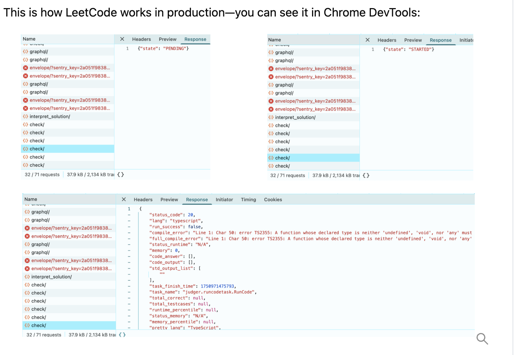
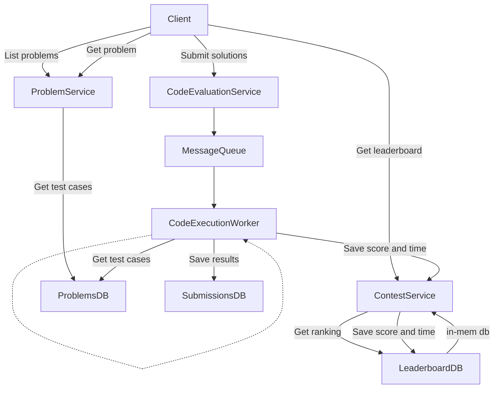
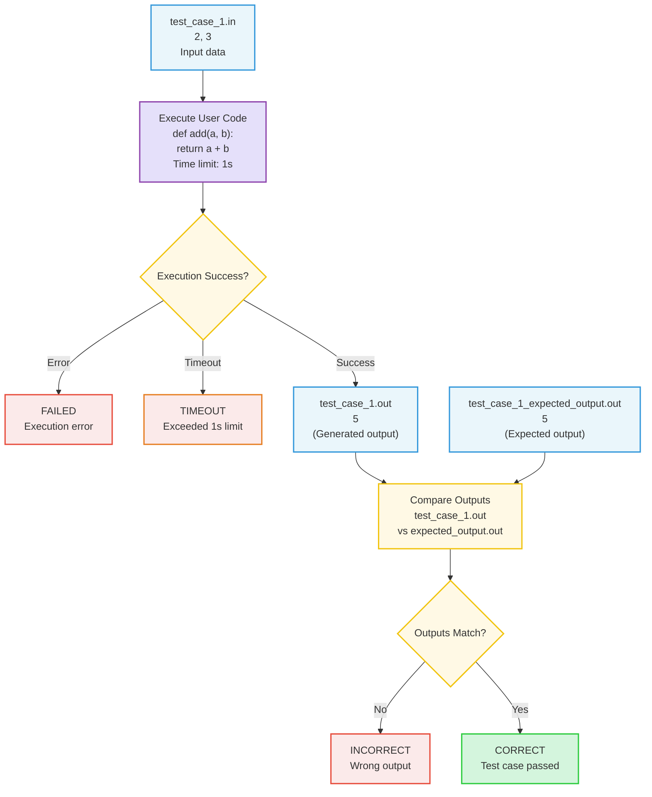
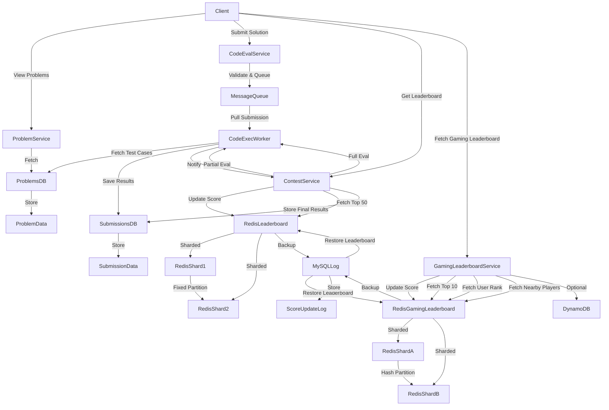

# LeetCode System Design

Library of multiple Questions
for each question u can write, compile and submit code against test cases and get immediate feedback on correctness.

admin can set up contest
contest: timed slot where users solve a set of question and compete with each other
rank based on accuracy, speed
real time updates, once contest ends leaderboard freezes

---

**Functional Requirements & API Endpoints**

- View Problems(Read Operation):
  - GET `/problems?start={start}&end={end}` (list of questions, paginated)  
     `json
        //response
        {
            problems: [
                { id: string, title: string, difficulty: string }
            ]
        }
    `

  - GET `/problems/:problem_id` (specific problem)
    `json
        //response
        {
            id: string,
            title: string,
            difficulty: string,
            description: string,
            constraints: string,
            examples: [{
                input: string,
                output: string
            }],
            starter_code: {
                language: string,
                code: string
            }
        }
    `

- Submit Solution(Create+Read Operation):
  - POST `/problems/:problem_id/submission` (submit code)
    `json
        //request
        {
            user_id: string,
            code: string,
            language: string
        }
    `

        ```json
            //response
            {
                status: success | fail,
                test_cases: [
                    { status: success | fail | timeout }
                ]
            }
        ```

  - GET `/submissions/:submission_id/status` (poll for result)

- Coding Contest & Leaderboard:
  - GET `/contests/:contest_id/leaderboard` (top 50 and user rank itself, real-time)
    `json
        //response
        {
            ranking: [
                { user_id: string, score: number }
            ]
        }
    `

## code retention policy of 1 month(after that code gets deleted)

**High-Level Architecture**

- Client: Sends HTTP requests, polls for results.
- Problems Service: Handles problem viewing, stores problem metadata.
- Code Evaluation Service: Receives submissions, validates, pushes to queue.
- Message Queue: Buffers submissions for async processing.
- Code Execution Workers: Pull from queue, run code in containers, update results.
- Contest Service: Calculates scores, updates leaderboard in Redis.
- Redis: Stores leaderboard as sorted set for fast top-N queries.

---

**Key Design Decisions**

- **Isolation & Security:**
  - Run user code in containers (Docker) with strict resource limits (CPU, memory, network, read-only FS).
  - Use seccomp, cap-drop, and network isolation for sandboxing.
- **Scalability:**
  - Pre-scale execution workers before contest start.
  - Use message queue to absorb submission spikes.
  - Two-phase processing: partial test cases during contest, full after.
- **Leaderboard:**
  - Use Redis ZSET for real-time ranking (O(log n) updates, O(n) top-N queries).
  - Composite score (points + time + penalties) packed into single numeric value.
- **Async Feedback:**
  - Immediate submission response with ID.
  - Client polls for result; avoids long-lived connections.

---

**Non-Functional Requirements**

- High availability (24/7)
- High scalability (10k concurrent users)
- Low latency (real-time leaderboard, fast feedback)
- Security (sandboxed code execution)
- Data durability (persist submissions for 1 month)

---

**Deep Dive Topics**

- Test case verification: Compare output files to expected results.
- Score calculation: Points for correct solutions, time as tie-breaker, penalties for wrong attempts.
- Redis score packing: Encode points and time for correct ranking.
- Handling spikes: Message queue + pre-scaling + partial evaluation.

---

**Code Execution**

Container (Docker)
Very Suitable
Lightweight, isolated execution environments

How it works:
Containers package the code and its dependencies together. They share the host OS kernel but run in isolated user spaces, providing a lightweight, consistent environment.

Pros:
Efficient resource use: Lighter than VMs, allowing more concurrent executions
Fast startup: Containers can start in seconds
Consistent environment: Ensures code runs the same way in development and production
Good isolation: Processes in one container can't directly affect others

Cons:
Less isolation than VMs: All containers share the host OS kernel
Potential security issues if not properly configured
Learning curve for container technologies

Conclusion:
Very suitable for this use case. Offers a good balance of security, performance, and resource efficiency.

During a contest with 5,000 submissions in the first minute, most would hit cold starts. Containers let us pre-scale—we spin up 100 containers 5 minutes before the contest starts, avoiding cold-start latency entirely

Each submission runs in a fresh container with strict resource limits. After execution completes, results (pass/fail, execution time, memory usage) are saved to the Submissions table and the container terminates.

Code execution can take several seconds, so we can't have the API call just wait. We need an async approach.
The solution: return a submission ID immediately, then let the client check back for results.

1. **Immediate response**: Code Evaluation Service returns `{"submission_id": "abc123", "status": "pending"}` in under 100ms
2. **Polling**: Client polls GET `/submissions/abc123/status` every 1-2 seconds
3. **Result delivery**: When execution completes, the endpoint returns `{"status": "success", "passed": 8, "failed": 2, "time": 45ms}`

Leetcode:

check/ endpoint gives PENDING, then moves to STARTED then response will have the data



This is how LeetCode works in production—you can see it in Chrome DevTools:

- The client polls the `check/` endpoint repeatedly after submission.
- The response transitions through states:
  - `{ "state": "PENDING" }`
  - `{ "state": "STARTED" }`
  - Final response contains detailed result data, e.g.:

```json
{
  "status_code": 20,
  "lang": "typescript",
  "run_success": false,
  "compile_error": "...",
  "status_runtime": "N/A",
  "memory": 0,
  ...
}
```

This polling pattern allows the client to provide real-time feedback on submission status and results, without requiring long-lived connections.

---

**Coding Contest**

User can participate in coding contest. The contest is a timed event with a fixed duration of 2 hours consisting of four questions. The score is calculated based on the number of questions solved and the time taken to solve them. The results will be displayed in real time. The leaderboard will show the top 50 users with their usernames and scores.

A contest is four problems with a 2-hour time window. The submission infrastructure already works—users submit code, it gets executed, results come back. So what's new?

The leaderboard. A user solves a hard problem at minute 45. They refresh the page: rank 47. Thirty seconds later, they refresh again: rank 52. Five users just submitted faster solutions. During the first 10 minutes of a contest, rankings change every few seconds as 10,000 developers compete.

This creates a data problem. Every submission that passes test cases updates that user's score. Their rank might change. Everyone below them shifts down one position. At peak, that's hundreds of score updates per second, each potentially reshuffling thousands of ranks. We need fast writes (update scores) and fast reads (query top 50).

A SQL database would struggle. The query `SELECT * FROM leaderboard ORDER BY score DESC LIMIT 50` scans and sorts the entire leaderboard on every request. With scores changing hundreds of times per second, the ORDER BY never gets to use a stable index—it's recalculating constantly. We need a data structure that maintains sorted order automatically.

This points to an in-memory data structure like Redis sorted sets. When you insert a score, Redis maintains order using a skip list internally—no separate sort step needed. Querying top 50 is O(log n + 50), not O(n log n). Updates happen in O(log n). This matches our access pattern: frequent writes, frequent sorted queries.

We'll use a Contest Service to orchestrate this. When Code Evaluation Service finishes grading a submission, it notifies Contest Service. Contest Service calculates the new score (combining points and time penalties) and updates Redis. The leaderboard API queries Redis sorted set for top 50.



---

**Code Evaluation Service**
The Code Evaluation Service decides if a submission is correct by comparing the output of the code with the expected output.

need a language-agnostic way to store test cases so we don't have to maintain separate test cases for Python, Java, C++, etc.

Test case files:

`test_case_1.in`

```txt
2, 3
```

`test_case_1_expected_output.out`

```txt
5
```

`test_case_1.out`

```txt
5
```

The Code Evaluation Service will run the code with the input and get an output file `test_case_1.out`. It will then compare `test_case_1.out` with `test_case_1_expected_output.out`. If they are the same, the submission is marked as correct. Otherwise, it's marked as incorrect.

---

### Test Case Database Storage (Implemented)

Test cases are stored as **relational rows** in PostgreSQL via Prisma:

```prisma
model TestCase {
  id             String  @id @default(uuid())
  problemId      String
  input          String
  expectedOutput String
  isSample       Boolean @default(false)
  points         Int     @default(0)

  problem Problem @relation(fields: [problemId], references: [id])
}
```

**Why Relational (not JSON)?**
| Use Case | Relational | JSON |
|----------|------------|------|
| Update single test case | Easy | Parse → modify → rewrite |
| Delete test case | Easy | Parse → filter → rewrite |
| Query hidden tests only | `WHERE isSample = false` | Filter in code |
| Per-test-case scoring | `points` field | Need array structure |
| Database indexes | On `problemId` | None possible |
| Judge targeting specific test | Direct query | Load all, filter |

**Alternatives Considered:**

1. **JSON array in problem row**: All test cases as `testCases Json[]`
   - Simpler schema but harder updates
   - No database-level filtering
2. **Separate table per problem**: `problem_123_testcases`
   - Extreme isolation but hard to query across problems

**Conclusion**: Relational is best for CP platforms (matches Codeforces/AtCoder patterns).

---

### Test Case Verification Flow (Mermaid)



Testcases we want in cf style, no need for boilerplate code

U need to directly put and submit the code, not like lc, where u run it different and then actual submit is different

Show real time updates like running on test 1

_Mermaid diagram: Test case verification flow with styled nodes for input, output, code, decisions, errors, timeout, and correct results._

---

### security and isolation in code execution

Running the code in a sandboxed environment like a container already provides a measure of security and isolation. We can further enhance security by limiting the resources that each code execution can use, such as CPU, memory, and disk I/O. We can also use technologies like seccomp to further limit the system calls that the code can make.

To be specific, to prevent malicious code from affecting other users' submissions, we can use the following techniques:

- **Resource Limitation:** Limit the resources that each code execution can use, such as CPU, memory, and disk I/O.
- **Time Limitation:** Limit the execution time of each code execution.
- **System Call Limitation:** Use technologies like seccomp to limit the system calls that the code can make.
- **User Isolation:** Run each user's code in a separate container.
- **Network Isolation:** Limit the network access of each code execution.
- **File System Isolation:** Limit the file system access of each code execution.

Sample Docker command for secure execution:

```
docker run --cpus="0.5" --memory="512M" --cap-drop="ALL" --network="none" --read-only <image>
```

This limits the code execution to use at most 0.5 CPU, 512 MB of memory, disables all capabilities, restricts network access, and makes the filesystem read-only.

---

### implement a leaderboard that supports top N queries in real time

For real-time leaderboards, Redis Sorted Set (ZSET) is the best option. It stores user scores in an in-memory sorted set, allowing fast updates and queries.

- **How it works:**
  - Each user is a member of the set, with their score as the sorting key.
  - Internally, Redis uses a hash map and a skip list for efficient O(log n) operations.

- **Pros:**
  - Extremely fast reads and writes
  - Built-in ranking and range queries
  - Scales to high concurrency

- **Cons:**
  - Data is volatile (in-memory)
  - Needs persistence if you want to keep data after restart

- **Example:**
  - Add scores: `ZADD leaderboard 100 user1`
  - Get top N: `ZREVRANGE leaderboard 0 1` (returns top 2 users)

## This matches contest needs: frequent updates, fast top-N queries, and temporary data.

### Contest Scores

A fair ranking system must answer:

- who solved harder problems,
- who solved them faster, and
- who made fewer failed submissions to discourage guessing.

This leads us to a three-component score.

_Points_: The primary factor. Harder problems award more points. If User A solves 3 problems worth 500+1000+2000=3500 points and User B solves 2 problems worth 500+1000=1500 points, User A ranks higher regardless of time.

_Time_: The tie-breaker when points are equal. We track when you submit your last correct solution. Between two users with 1500 points, the one who finished at minute 30 beats the one who finished at minute 45.

_Penalties_: Wrong submissions add time. Each failed attempt typically adds 5 minutes. This discourages guessing.

this was leetcode;

codeforces: adds time pressure by decaying problem values (a 500-point problem drops ~4 points per minute) and deducting 50 points per wrong submission.

**Storing Composite Scores(points + time) in Redis sorted sets**

Rankings depend on points (primary) and time (tie-breaker), but Redis sorted sets only accept one numeric score per member. Here are three ways to pack both values:

1.  Decimal Offset Method
    For small scoreboards, use decimals:

        redis_score = points + 1/(1 + time_in_seconds)

Example:

- User A: 5 solved, 120s → 5.008264
- User B: 5 solved, 90s → 5.010989
- User C: 6 solved, 500s → 6.001996

Rankings: C > B > A. Simple and readable, but not reliable for large scores due to floating-point precision.

2.  Big Multiplier Formula
    Multiply points by a large constant, add inverted time:

        redis_score = (points × 1,000,000,000) + (1,000,000,000 - time_in_seconds)

Example:

- User A: 5 solved, 120s → 5,999,999,880
- User B: 5 solved, 90s → 5,999,999,910
- User C: 6 solved, 500s → 6,999,999,500

This works reliably at any scale and avoids precision issues.

3.  Bit-Packing
    Store points in high 32 bits, inverted time in low 32 bits:

        MAX_TIME = 0xFFFFFFFF
        redis_score = (points << 32) | (MAX_TIME - time_in_seconds)

Efficient and precise, but harder to debug.

**Industry standard:** Use the big multiplier formula for contests. It’s simple, reliable, and avoids floating-point issues.

### Large Submission at Same Time/Two-Phase Processing for Contest Submissions

To handle high submission volume, use a two-phase evaluation:

**Phase 1 (During Contest): Partial Evaluation**

- Run submissions against ~10% of test cases.
- Provide immediate feedback and partial standings.

**Phase 2 (Post-Contest): Full Evaluation**

- After the contest ends, run submissions on all test cases.
- Official results are based on full evaluation.

**Benefits:**

- Reduces system load during contest by 90%.
- Enables fast feedback for users.
- Final results are more accurate.

This approach is proven at scale (e.g., Codeforces). Users get quick feedback to debug and resubmit, while final validation happens after the deadline when code changes are no longer allowed.

---

---

# Final Architecture


