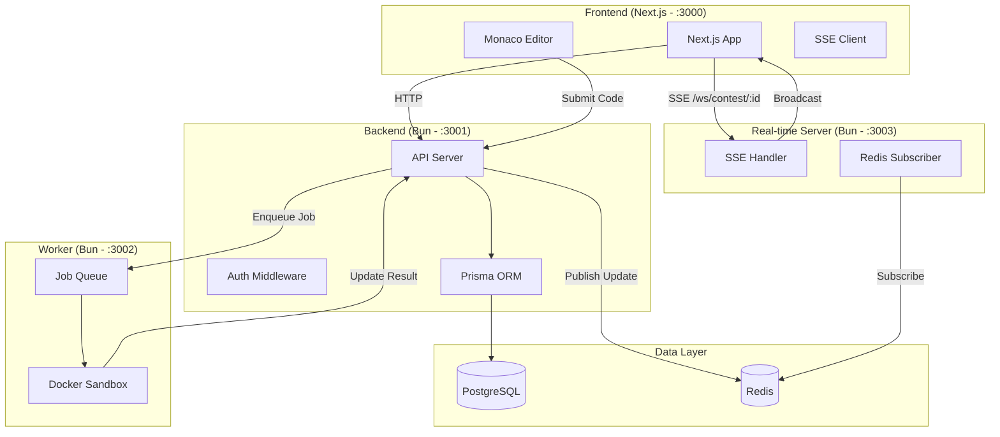
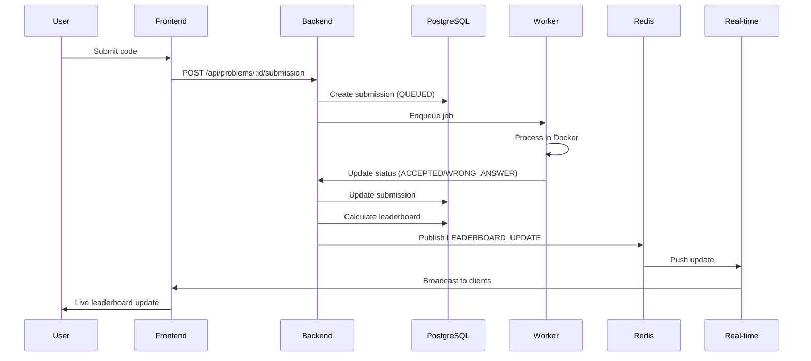
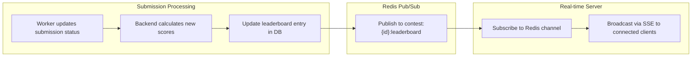

# Architecture

AlgoHaven is a monorepo of four services, built with [Turborepo](https://turbo.build) + Bun.



## Service Ports

| Service   | Port | Purpose         |
| --------- | ---- | --------------- |
| Frontend  | 3000 | Next.js UI      |
| Backend   | 3001 | REST API        |
| Worker    | 3002 | Code execution  |
| Real-time | 3003 | SSE / WebSocket |

## Data Flow: Submission



## Data Flow: Real-time Leaderboard



## Repository Structure

```
apps/
├── fe/       # Next.js frontend (:3000)
├── be/       # Backend API server (:3001)
├── worker/   # Code execution sandbox (Docker-in-Docker) (:3002)
└── ws/       # Real-time SSE server (:3003)
packages/
├── auth/             # Auth + session handling
├── db/               # Prisma schema, client & migrations
├── redis/            # Redis client + pub/sub helpers
├── ui/               # Shared UI components
├── logger/           # Shared logging
├── utils/            # Shared utilities
├── eslint-config/    # Shared ESLint config
└── typescript-config # Shared TS config
```

For a detailed analysis of the system design decisions, see [System Design](./design.md). For the code execution pipeline, see [Code Execution](./code-execution.md).